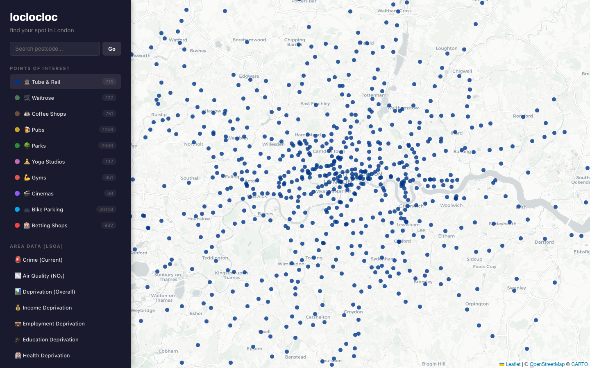

# loclocloc

**[Open the app →](https://loclocloc.netlify.app)** · **[Source on GitHub](https://github.com/12ian34/loclocloc)**

<p align="center">
  
</p>

**Find your spot in London** — an interactive map to explore amenities, public transport, and neighbourhood context side by side. Pin postcodes, toggle layers, and see how areas compare at a glance.

## What you can do

- **Search postcodes** — jump to an area and keep a shortlist of places you care about.
- **Point layers** — tube and rail, groceries, coffee, **libraries**, pubs, parks, gyms, cinemas, bike parking, and more. Each layer can be switched on or off.
- **Area layers** — choropleths for crime, air quality (NO₂), and Index of Multiple Deprivation dimensions, so you can read “how this patch of the city feels” next to the map.
- **Scorecards** — blended scores for each pinned postcode (proximity + area signals), with short explanations on what each metric means.
- **Optional travel-time rings** — public-transit reach from pinned postcodes when the app is configured for it.

Data is bundled as static GeoJSON in the repo, so the map works offline once built — no database required.

## Run it locally

```bash
npm install
npm run dev
```

Then open the URL Vite prints (usually `http://localhost:5173`).

## Build for production

```bash
npm run build
npm run preview   # serve the dist/ folder locally
```

## Updating bundled data

GeoJSON under `public/data/` is generated by Node scripts in `scrapers/`. Run everything from the **repository root** after installing app dependencies (the IMD pipeline uses the `xlsx` package from this project).

```bash
npm install
```

### Clearing caches (optional)

| File | When to delete it |
|------|-------------------|
| `public/data/_lsoa-boundaries.geojson` | You want to **re-download London LSOA polygons** from the ONS ArcGIS services (e.g. after a boundary release). The next area scraper that needs boundaries will fetch again. |
| `public/data/_imd_scores.xlsx` | You want to **re-download** the government IMD 2019 scores spreadsheet from the URL in `scrapers/imd.js` (e.g. if the file on gov.uk is replaced). |

### Area layers (LSOA) — run after `npm install`

These join or aggregate to LSOA boundaries (cached as above). **`crime.js` is slow**: it hits [data.police.uk](https://data.police.uk/) for many grid points with delays between batches — expect several minutes and be gentle on their service.

```bash
node scrapers/imd.js          # IMD 2019 → imd.geojson (+ may cache _imd_scores.xlsx)
node scrapers/air-quality.js   # NO₂ interpolation → air-quality.geojson
node scrapers/rent.js          # Modelled est. rent → rent.geojson (uses IMD cache + LSOA boundaries)
node scrapers/crime.js         # Latest police month → crime.geojson (slow)
```

### Point layers (OpenStreetMap / Overpass)

Each script overwrites its GeoJSON. Respect [Overpass usage](https://wiki.openstreetmap.org/wiki/Overpass_API) (no hammering; try off-peak if a query times out).

```bash
node scrapers/tube-rail.js
node scrapers/waitrose.js
node scrapers/coffee.js
node scrapers/libraries.js
node scrapers/pubs.js
node scrapers/parks.js
node scrapers/yoga.js
node scrapers/gyms.js
node scrapers/cinemas.js
node scrapers/bike-parking.js
node scrapers/betting.js
```

### Refresh everything used by the map (copy-paste)

POI scripts first (fast), then area layers (crime last if you want coffee while it runs):

```bash
for f in tube-rail waitrose coffee libraries pubs parks yoga gyms cinemas bike-parking betting; do node scrapers/$f.js; done
node scrapers/imd.js
node scrapers/air-quality.js
node scrapers/rent.js
node scrapers/crime.js
```

After updating files, commit the changed `public/data/*.geojson` (and optional caches if you intentionally refresh them), then rebuild or redeploy the site.

## Data sources

Bundled layers are static GeoJSON under `public/data/`, produced or refreshed by scripts in `scrapers/`. Interpretation here is for exploration only — not planning, legal, or financial advice.

### Map tiles

| What | Source |
|------|--------|
| Basemap | [CARTO](https://carto.com/) “Positron” style tiles; map data © [OpenStreetMap](https://www.openstreetmap.org/copyright) contributors |

### Point layers (POIs)

All of the following are queried from **OpenStreetMap** via the **[Overpass API](https://wiki.openstreetmap.org/wiki/Overpass_API)** (community-mapped data; completeness varies by area). Typical endpoint in this repo: `overpass-api.de`; some scrapers use `overpass.kumi.systems`.

| Layer | OSM tags / notes | Output file |
|-------|------------------|-------------|
| Tube & Rail | `railway=station`, `station=subway`, `railway=halt`, `station=light_rail` | `tube-rail.geojson` |
| Waitrose | `shop` + `brand` / `name` matching Waitrose | `waitrose.geojson` |
| Coffee shops | Cafes; chain filter in scraper | `coffee.geojson` |
| Libraries | `amenity=library` | `libraries.geojson` |
| Pubs | `amenity=pub` | `pubs.geojson` |
| Parks & green space | `leisure=park`, `garden`, `nature_reserve` (non-private where tagged) | `parks.geojson` |
| Yoga studios | `leisure=fitness_centre` + `sport=yoga` / name patterns, `sport=yoga`, etc. | `yoga.geojson` |
| Gyms | `leisure=fitness_centre` | `gyms.geojson` |
| Cinemas | `amenity=cinema` | `cinemas.geojson` |
| Bike parking | `amenity=bicycle_parking` | `bike-parking.geojson` |
| Betting shops | `shop=bookmaker` / `betting`, `amenity=gambling` | `betting.geojson` |

### Area layers (LSOA choropleths)

| Layer | Source | Output file |
|-------|--------|-------------|
| **LSOA boundaries** | [ONS Open Geography Portal](https://geoportal.statistics.gov.uk/) — Lower Layer Super Output Areas (2021), filtered to London via LSOA–LAD lookup | Cached as `_lsoa-boundaries.geojson` (used by scrapers) |
| **Crime (current)** | [data.police.uk](https://data.police.uk/) street-level crime API (grid sampling + assignment to LSOA) | `crime.geojson` |
| **Air quality (NO₂)** | Published annual mean NO₂ at monitoring sites (London Air / AURN-style figures in `scrapers/air-quality.js`), **inverse-distance interpolated** to LSOA centroids — modelled surface, not a regulatory map | `air-quality.geojson` |
| **Est. rent (£/mo)** | **Modelled** in `scrapers/rent.js`: IMD 2019 income / housing-barriers signals + hand-tuned borough median anchors → indicative monthly £ per LSOA. **Not** official rents or listings — exploration only | `rent.geojson` |
| **Deprivation (IMD 2019)** | [UK government IMD 2019 scores](https://www.gov.uk/government/statistics/english-indices-of-deprivation-2019) (spreadsheet), joined to LSOA boundaries | `imd.geojson` |

### Live services (not stored in the repo)

| What | Source |
|------|--------|
| Postcode search → coordinates | [postcodes.io](https://postcodes.io/) (Ordnance Survey open data) |
| Optional transit-time overlays | [TfL Journey API](https://api.tfl.gov.uk/) (`Journey/JourneyResults`) when a client key is configured |

### Attribution

Map tiles: © OpenStreetMap contributors, © CARTO. ONS, police, and government statistics remain © their respective owners; use and republication are subject to their licences and terms.

## License

[MIT](LICENSE)

---

*Built with [Vite](https://vitejs.dev/), [React](https://react.dev/), and [Leaflet](https://leafletjs.com/).*
